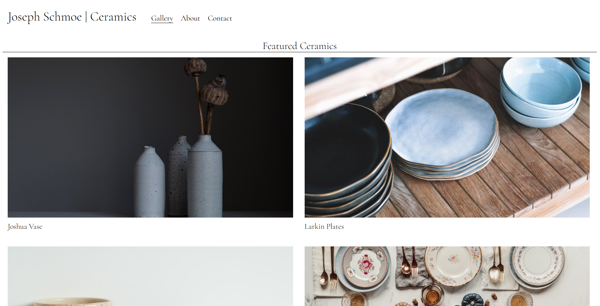
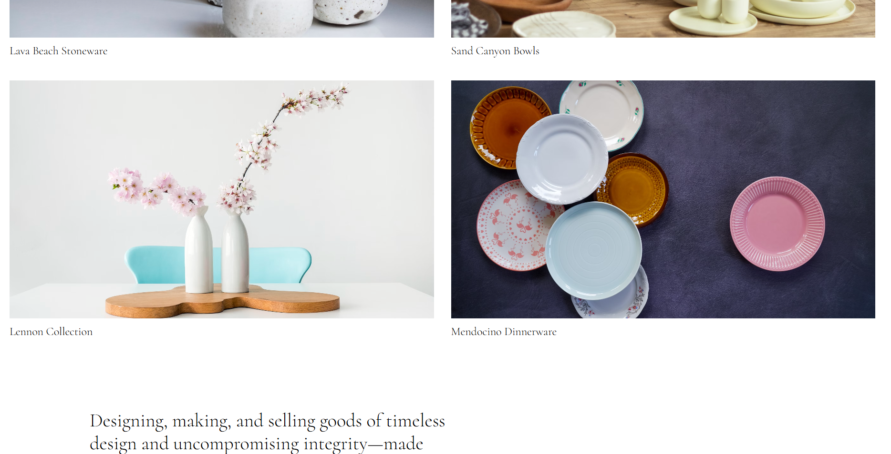

# Ceramics Portfolio 

## Table Of Contents
- [Description](#description)
- [Screenshots](#screenshots)
- [Getting Started](#getting-started)
- [Features](#features)
- [Challenges Faced](#challenges-faced)
- [What I learned](#what-i-learned)
- [Takeaways](#takeaways)
- [Future Plans](#future-plans)
- [Contact Info](#contact-info)

## Description
My first HTML/CSS project! This one being a handcrafted HTML/CSS portfolio for Joseph Schmoe Ceramics, showcasing a curated collection of great ceramic pieces. The site reflects the brand's philosophy: creating goods with integrity, intention, and artistry.

## Screenshots

## Getting Started

Enter the website at [Potter Portfolio](https://bigcolossal.github.io/ArtistPortfolio/)

## Features
- Semantic and responsive HTML5 and CSS structure and styling
- Google Fonts Integration

## Challenges Faced
Some challenges I faced during this project was making semantic HTML, as I had only known how to use div's and sections. Picking which were the best options for replacing these containers costed some time and research. 

Along with this, the overall designing of the margins/padding was also difficult. Many bugs appeared while attempting to make text appear in places where I wanted them to be.

## What I learned
- The best semantic choices within a HTML5 document
- Google Fonts
- Margins, padding, and among other styling for positioning content within a document.
- Having a website look good for both PC and Mobile

## Takeaways
This project marked my first ever HTML/CSS project in my long journey as a full-stack developer, and it taught me many fundamentals for how website design and styling should be applied. I learned many best practices for the both HTML & CSS and I'm ready for my next project. 

## Future Plans
- Add more ceramic pieces
- Add animations

## Contact Info
- jeremyperez1409@gmail.com
